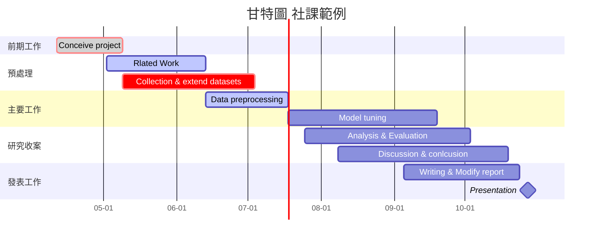
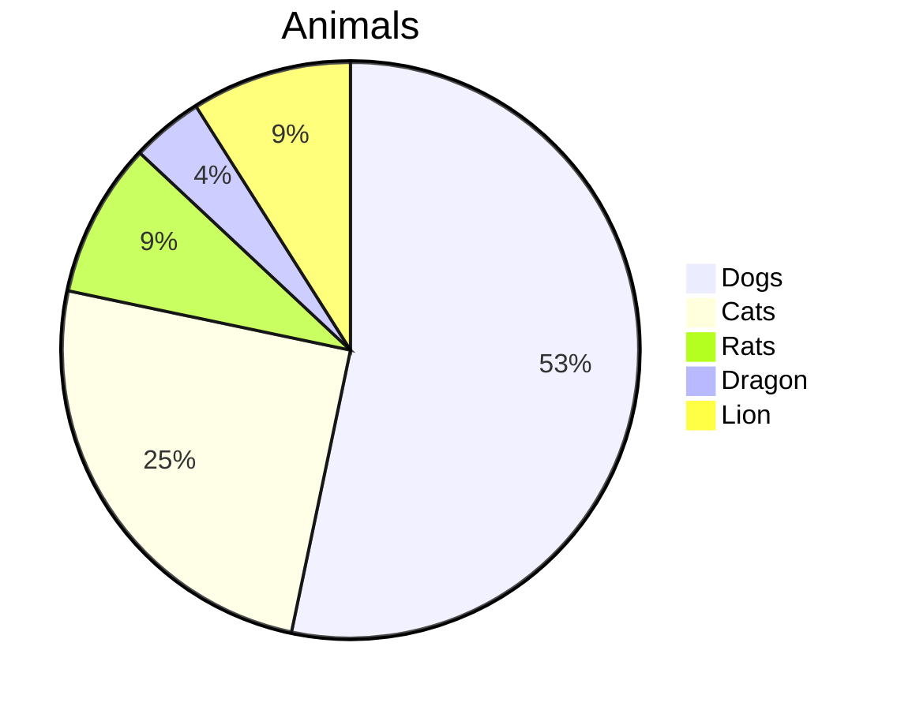

# 政附資訊 社課實作示範

> Created by 王修佑 (GitHub [@WHY-Hugo](https://github.com/WHY-Hugo))<br>
> [HackMD](https://hackmd.io/@hwang05/rkMEGXnH9?openExternalBrowser=1)
### 2022/04/29 社課X 
## Gantt

👉[開啟雙欄模式檢視原始語法](https://hackmd.io/T-UpzCz-QV-AMSDCmXIVUw?both)

````

````


### 👍好站推薦
- [如何繪製甘特圖](https://hackmd.io/@hackmd-marketing/draw-gantt?utm_source=twitter&utm_medium=post-link)
- [Mermaid.js document](https://mermaid-js.github.io/mermaid/#/gantt?id=syntax)

## Pie Chart
👉[開啟雙欄模式檢視原始語法](https://hackmd.io/T-UpzCz-QV-AMSDCmXIVUw?both)
````

````


### 👍好站推薦
- [畫圖真的好簡單](https://hackmd.io/c/tutorials-tw/https%3A%2F%2Fhackmd.io%2F%40docs%2Fmermaid_pie?fbclid=IwAR0dQVb-373PL-57PhsdOWoOFYgh2j1JrA78hwTzD6NP92q6XY90X9jD5g0)

